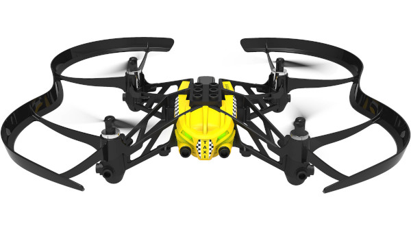

# TinyGo Bluetooth Minidrone

The Parrot Minidrones are very inexpensive drones that are controlled using Bluetooth LE aka Bluetooth 4.0.

This package allows you to control a minidrone using the TinyGo `bluetooth` package, so it will work both on computers as well as on bare metal microcontrollers with Bluetooth support.

## Supported drones

Models that are known to work with this package include:

- Parrot Rolling Spider
- Parrot Airborne Cargo Mars
- Parrot Airborne Cargo Travis
- Parrot Mambo

Models that should work now, but have not been tested by us:

- Parrot Airborne Night Swat
- Parrot Airborne Night Maclane
- Parrot Airborne Night Blaze
- Parrot HYDROFOIL Orak
- Parrot HYDROFOIL NewZ

Models that will require additional work for compatibility:

- Parrot Swing

## Examples

See the examples folder. The "takeoff" examples should work on all platforms.

## Tutorial

[Check out the step by step tutorial](./tutorial/)

## MCP Server

[Check out the MCP Server](./cmd/mcp-minidrone)
